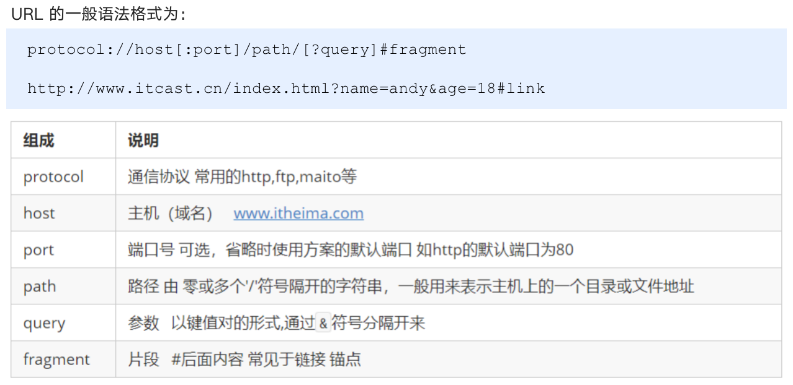
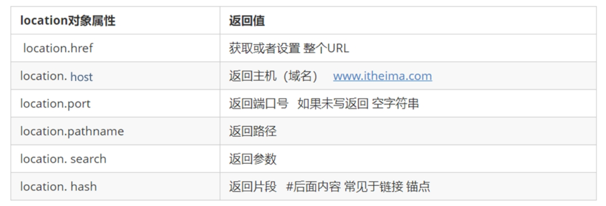
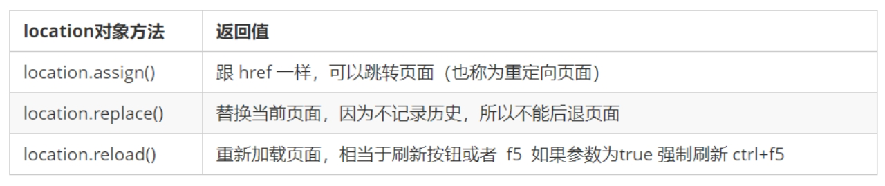
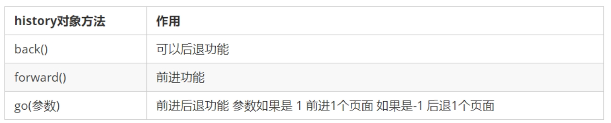
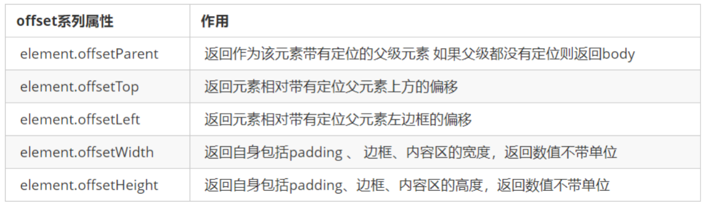
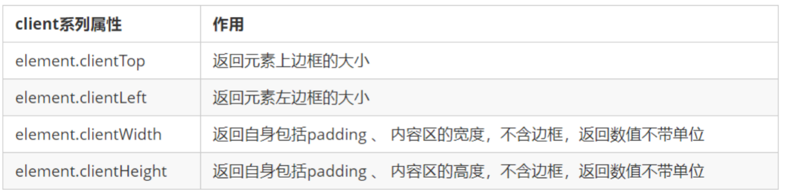
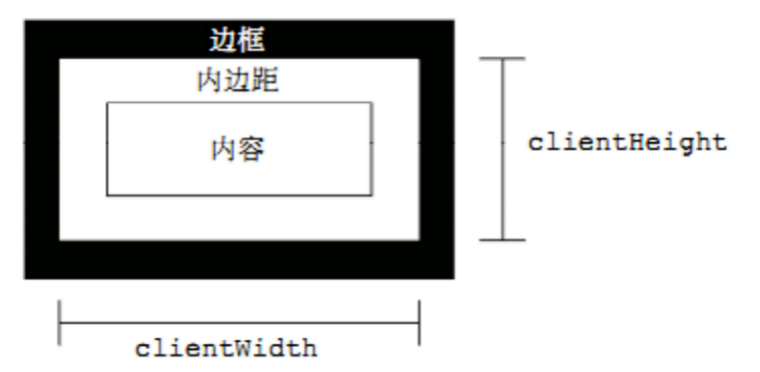
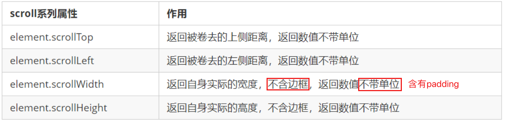
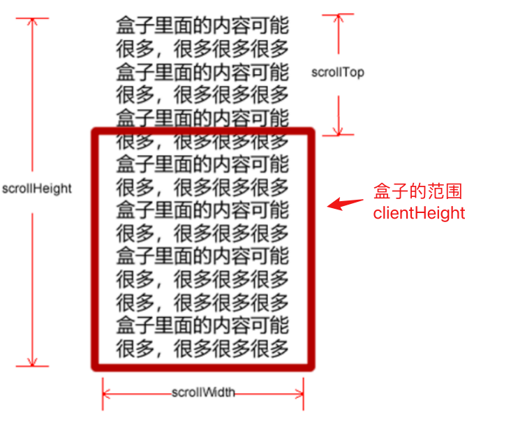

# webCourses

## Javascript

### Tips

- 预解析
- \+ 存在隐藏的强制类型转换
- string 基本包装类型:把简单数据类型包装成为了复杂数据类型
- null 是 js 中的一个小 bug,虽然是简单数据类型 但是用 typeof 可以得到返回的是一个空的对象 object

### 堆栈空间区别

- 栈（操作系统）:由操作系统自动分配释放存储函数的参数值、局部变量的值等。其操作方式类似于数据结构中的栈；
  - **简单数据类型存放到栈里面** string,number,boolean,undefined,null
- 堆（操作系统）:存储复杂类型（对象），一般由程序员分配释放，若程序员不释放，由垃圾回收机制回收。

  - **复杂数据类型存放到堆里面** Object Array Date

- 简单数据类型是存放在栈里面 里面直接开辟一个空间存放的就是值
  - 简单数据类型传参的时候是直接传值
- 复杂数据类型 首先在栈里面存放地址 十六进制表示 然后这个地址指向堆中的数据
  - 复杂数据类型传参的时候实际是把变量在栈空间里保存的堆的地址复制给了形参，形参和实参其实保存的是同一个堆地址，所以操作的是同一个对象

## DOM 和 BOM

### DOM

- DOM Document Object Manage
- BOM Browser Object Manage

#### 表单属性 Tips

- 表单 input 的值为 value
- type="text" type="password"
- 隐藏元素 display:none
- 显示元素 display:block
- `<input type="checkbox" />` checkbox 表单有 checked 属性 True 为勾选 False 为不勾选

#### 事件类型

- 注意循环事件绑定和事件触发的顺序
  - 循环事件绑定全部完成后，才进入到事件触发的过程，因此触发事件时，循环计数器次数=总次数。
  - eg: Day2 06-tab 栏切换
- 获得焦点事件 onfocus
- 失去焦点事件 onblur
- 鼠标经过事件 onmouseover
- 鼠标离开事件 onmouseout

#### 自定义属性的操作

1.获取属性值

- element.属性
  - element.id
  - element.className
  - element.classList
- element.getAttribute('属性') 

2.区别
- element.属性 获取内置属性值(元素本身自带的属性)
- element.getAttribute('属性') 主要获取自定义的属性(标准) 我们程序员自定义的属性

3.设置元素属性值
- element.属性 = '值' 设置内置属性值。
  - div.className = 'footer’
  - 也可以把element当做object，==增加键值对，但是注意此时不会显示到html中==。
- element.setAttribute('属性','值') 主要针对于自定义属性
  - div.setAttribute('class', 'footer'); // class 特殊 这里面写的就是 class 不是 className
  - ==此时会显示到html中==

4.移除属性 removeAttribute('属性')
div.className="" 和 div.removeAttribute('class')有一定区别

- div.className="" 还是会存在 class `<div class></div>`
- div.removeAttribute('class') 不会存在 class `<div></div>`

5.h5 自定义属性

- h5 新增的获取自定义属性的方法 它只能获取 data-开头的
- 而元素.dataset 是一个集合里面存放了所有以 data-开头的自定义属性
  - div.dataset {"index":2,"time":20}
  - div.dataset['index'] = 2
  - div.dataset.time = 20
- 如果自定义属性里面有多个-链接的单词，我们获取的时候采取驼峰命名法
  - `<div data-list-name="andy"></div>`
  - div.dataset.listName="andy"

#### 节点

##### 节点概述

一般地，节点至少拥有 nodeType（节点类型）、nodeName（节点名称）和 nodeValue（节点值）这三个基本属性。

- 元素节点 nodeType 为 1
- 属性节点 nodeType 为 2
- 文本节点 nodeType 为 3 （文本节点包含文字、空格、换行等）
  我们在实际开发中，节点操作主要操作的是元素节点

##### 节点层级

- 父节点 node.parentNode 得到的是离元素最近的父级节点(亲爸爸) 如果找不到父节点就返回为 null
  - var son = document.querySelector('.navs');
  - console.log(son.parentNode);
- 子节点
  - parentNode.childNodes 返回包含指定节点的子节点的集合，该集合为即时更新的集合。
    - 注意：返回值里面包含了所有的子节点，包括元素节点，**文本节点**等。
    - 如果只想要获得里面的元素节点，则需要专门处理（判断 nodeType==1）。 所以我们一般不提倡使用 childNodes
    ```html
    var ul = document. querySelector(‘ul’); for(var i = 0; i <
    ul.childNodes.length;i++) { if (ul.childNodes[i].nodeType == 1) { //
    ul.childNodes[i] 是元素节点 console.log(ul.childNodes[i]); } }
    ```
  - parentNode.children 是一个只读属性，返回**所有的子元素节点**。它**只返回子元素节点**，其余节点不返回
- 第一个和最后一个子节点
  - ol.children[0];
  - ol.children[ol.children.length - 1];
- 兄弟节点
  - nextElementSibling 返回当前元素下一个兄弟元素节点，找不到则返回 null。
  - previousElementSibling 返回当前元素上一个兄弟节点，找不到则返回 null。
  - 但是以上两种有兼容性问题
  ```html
  function getNextElementSibling(element) { var el = element; while (el =
  el.nextSibling) { if (el.nodeType === 1) { return el; } } return null; }
  ```
- 创建节点 document.createElement('tagName')
  - document.createElement() 方法创建由 tagName 指定的 HTML 元素。因为这些元素原先不存在，是根据我们的需求动态生成的，所以我们也称为动态创建元素节点。
- 添加节点
  - node.appendChild(child)
    - node.appendChild() 方法将一个节点添加到指定父节点的子节点列表末尾。类似于 CSS 里面的 after 伪元素。
  - node.insertBefore(child, 指定元素)
    - node.insertBefore() 方法将一个节点添加到父节点的指定子节点前面。类似于 CSS 里面的 before 伪元素。
- 删除节点 node.removeChild(child)
  - node.removeChild(child) 从 DOM 中删除一个子节点,返回删除的节点
  - 可以结合 node.children\[i\]进行删除元素
  - node.removeChild(node.children\[i\])
- 阻止链接跳转需要添加`javascript:void(0)`; 或者`javascript:;`
- 复制节点
  - node.cloneNode() 返回调用该方法的节点的一个副本
  - node.cloneNode(); 括号为空或者里面是 false 浅拷贝 只复制标签不复制里面的内容
  - node.cloneNode(true); 括号为 true 深拷贝 复制标签复制里面的内容
- 三种创建元素的方式
  - 1. document.write() 是直接将内容写入页面的内容流，但是**文档流执行完毕，则它会导致页面全部重绘**。只剩下 write 的内容
  - 2. innerHTML 创建元素
    - 将内容写入某个 DOM 节点，不会导致页面全部重绘
    - 创建多个元素效率更高(不要拼接字符串，采取数组形式拼接)，结构稍微复杂
  - 3. document.createElement(tagname) 创建元素
    - 创建多个元素效率稍低一点点，但是结构更清晰

#### DOM 重点核心

关于 dom 操作，我们主要针对于元素的操作。主要有创建、增、删、改、查、属性操作、事件操作。

- 增
  - 1. appendChild
  - 2. insertBefore
- 删
  - 1. removeChild
- 改
  - 主要修改 dom 的元素属性，dom 元素的内容、属性, 表单的值等
  - 修改元素属性： src、href、title 等
  - 修改普通元素内容： innerHTML 、innerText
  - 修改表单元素： value、type、disabled 等
  - 修改元素样式： style、className
- 查
  - 主要获取查询 dom 的元素
  - DOM 提供的 API getElementById、getElementsByTagName 古老用法 不太推荐
  - H5 提供的新方法 querySelector、querySelectorAll 提倡
  - 利用节点操作获取元素： 父(parentNode)、子(children)、兄(previousElementSibling、nextElementSibling) 提倡
- 属性操作
  - 主要针对于自定义属性。
  - 1. setAttribute：设置 dom 的属性值
  - 2. getAttribute：得到 dom 的属性值
  - 3. removeAttribute 移除属性
- 事件操作
  - 给元素注册事件,采取事件源.事件类型 = 事件处理程序

#### 事件高级

##### 注册事件（绑定事件）

给元素添加事件，称为注册事件或者绑定事件。
注册事件有两种方式：传统方式和方法监听注册方式
**1. 传统注册方式**

- 利用 on 开头的事件 onclick
- `<button onclick=“alert('hi~')”></button>`
- `btn.onclick = function() {} `
- 特点： 注册事件的唯一性
- 同一个元素同一个事件只能设置一个处理函数，最后注册的处理函数将会覆盖前面注册的处理函数
  **2. 事件侦听注册事件**
- `eventTarget.addEventListener(type, listener[, useCapture])` 方法将指定的监听器注册到 eventTarget（目标对象）上，当该对象触发指定的事件时，就会执行事件处理函数。
  - type：事件类型字符串，比如 click 、mouseover ，注意这里不要带 on
  - listener：事件处理函数，事件发生时，会调用该监听函数
  - useCapture：可选参数，是一个布尔值，默认是 false。true 处于捕获阶段 document -> html -> body -> father -> son，false 处于冒泡阶段 son -> father ->body -> html -> document
- w3c 标准 推荐方式
- IE9 之前的 IE 不支持此方法，可使用 attachEvent() 代替
- 特点：同一个元素同一个事件可以注册多个监听器
- 按注册顺序依次执行

##### 删除事件（绑定事件）

**1. 传统注册方式**
`eventTarget.onclick = null;`
**2. 事件侦听注册事件**
`eventTarget.removeEventListener(type, listener[, useCapture]);`

##### 事件对象

```javascript
eventTarget.onclick = function (event) {};
eventTarget.addEventListener("click", fn);
function fn(e) {}
// 这个 event 就是事件对象，我们还喜欢的写成 e 或者 evt
// event 对象代表事件的状态，比如键盘按键的状态、鼠标的位置、鼠标按钮的状态。
```

- e.target 和 this 的区别：
  - this 是事件绑定的元素， 这个函数的调用者（绑定这个事件的元素） 比如 ul
  - e.target 是事件触发的元素 比如 li

##### 阻止默认行为（事件）

```javascript
阻止默认行为（事件） 让链接不跳转 或者让提交按钮不提交
var a = document.querySelector("a");
a.addEventListener("click", function (e) {
  e.preventDefault(); //  dom 标准写法
});
```

##### 阻止冒泡

事件冒泡：开始时由最具体的元素接收，然后逐级向上传播到到 DOM 最顶层节点。
事件冒泡本身的特性，会带来的坏处，也会带来的好处，需要我们灵活掌握。

- 标准写法：利用事件对象里面的 stopPropagation()方法
  `e.stopPropagation()`
- 非标准写法：IE 6-8 利用事件对象 cancelBubble 属性
  `e.cancelBubble = true;`

##### 常见的鼠标事件

1. 禁止鼠标右键菜单
   contextmenu 主要控制应该何时显示上下文菜单，主要用于程序员取消默认的上下文菜单

```javascript
document.addEventListener("contextmenu", function (e) {
  e.preventDefault();
});
```

2. 禁止鼠标选中（selectstart 开始选中）

```javascript
document.addEventListener("selectstart", function (e) {
  e.preventDefault();
});
```

3. 鼠标对象事件

- client 鼠标在可视区的 x 和 y 坐标
  - e.clientX
  - e.clientY
- page 鼠标在页面文档的 x 和 y 坐标
  - e.pageX
  - e.pageY
- screen 鼠标在电脑屏幕的 x 和 y 坐标
  - e.screenX
  - e.screenY

4. 常见的键盘事件

- keyup 按键弹起的时候触发
- keypress 按键按下的时候触发
- keydown 按键按下的时候触发 能识别功能键 比如 ctrl shift 左右箭头等
- 三个事件的执行顺序 keydown -> keypress -> keyup

5. 键盘事件对象
   event.keyCode 键盘事件对象中的 keyCode 属性可以得到相应键的 ASCII 码值

- keyup 和 keydown 事件不区分字母大小写 a 和 A 得到的都是 65
- keypress 事件区分字母大小写 a=97 和 A=65

```javascript
document.addEventListener("keypress", fn);
function fn(e) {
  console.log(e.keyCode);
}
```

> e.key 可以直接返回字符而非 ASCII 码值 但是只适合高版本
> 注意: keydown 和 keypress 在文本框里面的特点: 他们两个事件触发的时候，文字还没有落入文本框中。
> keyup 事件触发的时候， 文字已经落入文本框里面了

### BOM

BOM（Browser Object Model）即浏览器对象模型，它提供了独立于内容而与浏览器窗口进行交互的对象，其核心对象是 window。

#### BOM 构成

window 对象是浏览器的顶级对象，它具有双重角色。

1. 它是 JS 访问浏览器窗口的一个接口。
2. 它是一个全局对象。定义在全局作用域中的变量、函数都会变成 window 对象的属性和方法。

在调用的时候可以省略 window，前面学习的对话框都属于 window 对象方法，如 `alert()` 、`prompt()` 等。

> 注意：window下的一个特殊属性 `window.name`

#### window 对象的常见事件

##### 窗口加载事件

```javascript
window.onload = function(){}
window.addEventListener("load",function(){});
```

window.onload 是窗口 (页面）加载事件,当文档内容==完全加载完成==会触发该事件(包括图像、脚本文件、CSS 文件等), 就调用的处理函数。

> 注意：
>
> 1. 有了 `window.onload` 就可以把 JS 代码写到页面元素的上方，因为 `onload` 是等页面内容全部加载完毕，再去执行处理函数。
>
> 2. `window.onload` 传统注册事件方式 只能写一次，如果有多个，会以最后一个` window.onload` 为准。
>
> 3. 如果使用 `addEventListener` 则没有限制

```javascript
window.onpageshow = function(){}
window.addEventListener("pageshow",function(){});
```

下面三种情况都会刷新页面都会触发 load 事件。

- a标签的超链接
- F5或者刷新按钮（强制刷新）
- 前进后退按钮

但是火狐具有==“往返缓存”==，这个缓存中不仅保存着页面数据，还保存了DOM和JavaScript的状态；实际上是将整个页面都保存在了内存里，所以此时后退按钮不能刷新页面。
此时可以使用 pageshow事件来触发。这个事件在页面显示时触发，无论页面是否来自缓存。在重新加载页面中，pageshow会在load事件触发后触发；根据事件对象中的persisted来判断是否是缓存中的页面触发的pageshow事件，注意这个事件给window添加。


```javascript
document.addEventListener('DOMContentLoaded',function(){})
```

`DOMContentLoaded` 事件触发时，==仅当DOM加载完成，不包括样式表，图片，flash等等==。**Ie9以上才支持**

如果页面的图片很多的话, 从用户访问到 `onload` 触发可能需要较长的时间, 交互效果就不能实现，必然影响用户的体验，此时用 `DOMContentLoaded` 事件比较合适。

##### 调整窗口大小事件

```javascript
window.onresize = function(){}
window.addEventListener("resize",function(){});
```

`window.onresize` 是调整窗口大小加载事件,当触发时就调用的处理函数。

> 注意：
> 1. 只要窗口大小发生像素变化，就会触发这个事件。
>
> 2. 我们经常利用这个事件完成**响应式布局**。`window.innerWidth` 当前屏幕的宽度

案例：

```javascript
window.addEventListener("load", function () {
        var div = document.querySelector("div");
        window.addEventListener("resize", function () {
          console.log(window.innerWidth);
          console.log("变化了");
          if (window.innerWidth <= 800) {
            div.style.display = "none";
          } else {
            div.style.display = "block";
          }
        });
      });
```

#### 定时器

##### 两种定时器

window 对象给我们提供了2个非常好用的定时器。

- setTimeout() 
- setInterval()   

##### setTimeout() 定时器

`window.setTimeout(调用函数, [延迟的毫秒数]);`

setTimeout() 方法用于设置一个定时器，该定时器在定时器到期后执行调用函数。**只调用一次就结束了这个定时器**

> 注意：
> 1. window 可以省略。
> 2. 这个调用函数可以直接写函数，或者写函数名或者采取字符串‘函数名()'三种形式。第三种不推荐
> 3. 延迟的毫秒数省略默认是0，如果写，必须是毫秒。
> 4. 因为定时器可能有很多，所以我们经常给定时器赋值一个标识符。
> 4. 这个函数中的调用函数和onclick中的调用函数都被称为`回调函数`。

停止 setTimeout() 定时器

`window.clearTimeout(timeoutID)`

clearTimeout() 方法取消了先前通过调用 setTimeout() 建立的定时器。

> 注意：
> 1. window 可以省略。
> 2. 里面的参数就是定时器的标识符。

##### setInterval() 定时器

`window.setInterval(回调函数, [间隔的毫秒数]);`

setInterval() 方法**重复调用一个函数，每隔这个时间，就去调用一次回调函数**。

> 注意：
> 1. window 可以省略。
> 2. 这个调用函数可以直接写函数，或者写函数名或者采取字符串 '函数名()'  三种形式。
> 3. 间隔的毫秒数省略默认是0，如果写，必须是毫秒，表示每隔多少毫秒就自动调用这个函数。
> 4. 因为定时器可能有很多，所以我们经常给定时器赋值一个标识符。
> 5. 第一次执行也是间隔毫秒数之后执行，之后每隔毫秒数就执行一次。

停止 setInterval() 定时器

`window.clearInterval(intervalID);`

clearInterval()方法取消了先前通过调用 setInterval() 建立的定时器。

> Tips:
>
> button中的文字用innerHTML修改
>
> input中的文字用value修改

#### Location 对象







#### navigator 对象

navigator 对象包含有关浏览器的信息，它有很多属性，我们最常用的是 userAgent，该属性可以返回由客户机发送服务器的 user-agent 头部的值。
下面前端代码可以判断用户那个终端打开页面，实现跳转。

```javascript
if((navigator.userAgent.match(/(phone|pad|pod|iPhone|iPod|ios|iPad|Android|Mobile|BlackBerry|IEMobile|MQQBrowser|JUC|Fennec|wOSBrowser|BrowserNG|WebOS|Symbian|Windows Phone)/i))) {
    window.location.href = "";     //手机
 } else {
    window.location.href = "";     //电脑
 }
```

#### history 对象

window 对象给我们提供了一个 history 对象，与浏览器历史记录进行交互。该对象包含用户（在浏览器窗口中）访问过的 URL。



### PC端网页特效异读

> 学习目标：
>
> 1. 元素偏移量 `offset` 系列
> 2. 元素可视区 `client` 系列
> 3. 元素滚动 `scroll` 系列
> 4. 动画函数封装
> 5. 常用网页特效案例

#### 1.元素偏移量 `offset` 系列

1.1 offset 概述

offset 翻译过来就是偏移量， 我们使用 offset 系列相关属性可以动态的得到该**元素的位置（偏移）**、**大小**等。

- 获得元素距离**带有定位父元素**的位置 (postion: relative;)

- 获得元素自身的大小（宽度高度）

> 注意: 返回的数值都不带单位



> Offset 和 style 的区别:
>
> 1. offset
> - offset 可以得到任意样式表中的样式值
> - offset 系列获得的数值是没有单位的
> - offsetWidth 包含padding+border+width
> - offsetWidth 等属性是只读属性，只能获取不能赋值
>   **所以，我们想要获取元素大小位置，用offset更合适**
> 2. style
> - style 只能得到行内样式表中的样式值
> - style.width 获得的是带有单位的字符串
> - style.width 获得不包含padding和border的值
> - style.width 是可读写属性，可以获取也可以赋值
>   **所以，我们想要给元素更改值，则需要用style改变**

#### 2.元素可视区 `client` 系列

client 翻译过来就是客户端，我们使用 client 系列的相关属性来获取元素可视区的相关信息。通过 client 系列的相关属性可以动态的得到该元素的边框大小、元素大小等。





> Tips:
>
> ==立即执行函数==: 不需要调用，立马能够自己执行的函数。
>
> `(function(){})() 或者 (function(){}());`
>
> ```javascript
> (function(a, b) {
>   console.log(a + b);
>   var num = 10; // 局部变量
> })(1, 2);
> (function sum(a, b) {
>   console.log(a + b);
>   var num = 10; // 局部变量
> }(2, 3));
> ```
>
> ==立即执行函数最大的作用就是独立创建了一个作用域，里面所有的变量都是局部变量，不会有命名冲突的情况。==

#### 3.元素滚动 `scroll` 系列

scroll 翻译过来就是滚动的，我们使用 scroll 系列的相关属性可以动态的得到该元素的大小、滚动距离等。





> `element.scrollTop`是元素被卷去的头部。
>
> `window.pageYOffset`是页面被卷曲的头部。
>
> ```javascript
> div.addEventListener(‘scroll’,function(){
> 	console.log(div.scrollTop);
> })
> ```

#### 4.三大系列的总结

offset 经常用于获得元素位置  `offsetLeft`   `offsetTop`
client 经常用于获取元素大小  `clientWidth`  `clientHeight`
scroll 经常用于获取滚动距离  `scrollTop`    `scrollLeft`   

> 注意页面滚动的距离通过 `window.pageXOffset` 获得


==补充：mouserover和mouseenter事件的区别==

mouseenter: 当鼠标移动到元素上时就会触发 mouseenter 事件

类似 mouseover，它们两者之间的差别是

- mouseover 鼠标经过自身盒子会触发，经过子盒子还会触发。
- mouseenter 只会经过自身盒子触发，不会冒泡
  - 跟mouseenter搭配 鼠标离开 mouseleave  同样不会冒泡

#### 5.动画函数封装

##### 5.1 动画实现原理 

==核心原理==：通过定时器 setInterval() 不断移动盒子位置。

实现步骤：
1. 获得盒子当前位置
2. 让盒子在当前位置加上1个移动距离
3. 利用定时器不断重复这个操作
4. 加一个结束定时器的条件
5. 注意此元素需要添加定位，才能使用element.style.left

##### 5.2 动画函数简单封装

注意函数需要传递2个参数，**动画对象**和**移动到的距离**。

```javascript
// 简单动画函数封装obj目标对象 target 目标位置
function animate(obj, target) {
  var timer = setInterval(function () {
    if (obj.offsetLeft >= target) {
      // 停止动画 本质是停止定时器
      clearInterval(timer);
    }
    obj.style.left = obj.offsetLeft + 1 + "px";
  }, 30);
}

var div = document.querySelector("div");
var span = document.querySelector("span");
// 调用函数
animate(div, 300);
animate(span, 200);
```

##### 5.3 动画函数给不同元素记录不同定时器

如果多个元素都使用这个动画函数，每次都要var声明定时器。我们可以给不同的元素使用不同的定时器（自己专门用自己的定时器）。
核心原理：利用 JS 是一门动态语言，可以很方便的给当前对象添加属性。

```javascript
function animate(obj, target) {
  // 当我们不断的点击按钮，这个元素的速度会越来越快，因为开启了太多的定时器
  // 解决方案就是 让我们元素只有一个定时器执行
  // 先清除以前的定时器，只保留当前的一个定时器执行
  clearInterval(obj.timer);
  obj.timer = setInterval(function () {
    if (obj.offsetLeft >= target) {
      // 停止动画 本质是停止定时器
      clearInterval(obj.timer);
    }
    obj.style.left = obj.offsetLeft + 1 + "px";
  }, 30);
}

var div = document.querySelector("div");
var span = document.querySelector("span");
```

