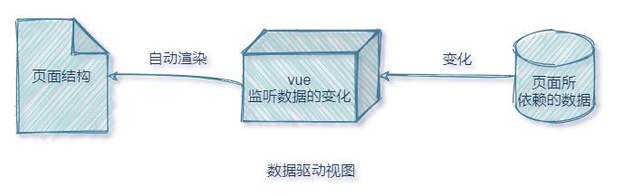

# Vue3

## 前端工程化与webpack

### webpack的基本使用

#### 1.什么是webpack

概念：webpack 是前端项目工程化的具体解决方案。

主要功能：它提供了友好的前端模块化开发支持，以及代码压缩混淆、处理浏览器端 JavaScript 的兼容性、性能优化等强大的功能。

好处：让程序员把工作的重心放到具体功能的实现上，提高了前端开发效率和项目的可维护性。

注意：目前企业级的前端项目开发中，绝大多数的项目都是基于 webpack 进行打包构建的。

#### 2.创建列表隔行变色项目
① 新建项目空白目录，并运行 `npm init –y` 命令，初始化包管理配置文件 package.json
② 新建 src 源代码目录
③ 新建 src -> index.html 首页和 src -> index.js 脚本文件
④ 初始化首页基本的结构
⑤ 运行 npm install jquery –S 命令，安装 jQuery
⑥ 通过 ES6 模块化的方式导入 jQuery，实现列表隔行变色效果

#### 3.在项目中安装 webpack

在终端运行如下的命令，安装 webpack 相关的两个包：

```bash
npm install webpack@5.5.1 webpack-cli@4.2.0 -D
```

#### 4.在项目中配置 webpack

① 在项目根目录中，创建名为 webpack.config.js 的 webpack 配置文件，并初始化如下的基本配置：

```javascript
module.exports = {
  mode: 'development' // mode 用来指定构建模式。可选值有 development 和 production
}
```

② 在 package.json 的 scripts 节点下，新增 dev 脚本如下：

```javascript
"scripts": {
  "dev": "webpack" // script 节点下的脚本，可以通过 npm run 执行。例如 npm run dev
}
```

③ 在终端中运行 `npm run dev` 命令，启动 webpack 进行项目的打包构建

##### 4.1 mode的可选值

mode 节点的可选值有两个，分别是：

① `development` 

- ==开发环境==
- 不会对打包生成的文件进行代码压缩和性能优化
- 打包速度快，适合在开发阶段使用

② `production` 

- ==生产环境==
- 会对打包生成的文件进行代码压缩和性能优化
- 打包速度很慢，仅适合在项目发布阶段使用

##### 4.2 webpack.config.js 文件的作用

webpack.config.js 是 webpack 的配置文件。webpack 在真正开始打包构建之前，会先读取这个配置文件，从而基于给定的配置，对项目进行打包。

注意：由于 webpack 是基于 node.js 开发出来的打包工具，因此在它的配置文件中，支持使用 node.js 相关的语法和模块进行 webpack 的个性化配置。

##### 4.3 webpack 中的默认约定

在 webpack 中有如下的默认约定： 

① 默认的打包入口文件为 src -> index.js

② 默认的输出文件路径为 dist -> main.js

注意：可以在 webpack.config.js 中修改打包的默认约定

##### 4.4 自定义打包的入口与出口

在 webpack.config.js 配置文件中，通过 entry 节点指定打包的入口。通过 output 节点指定打包的出口。

示例代码如下：

```javascript
const path = require('path')

module.exports = {
  mode: 'development', // development  production
  // 指定打包的入口
  entry: path.join(__dirname, './src/index.js'),
  // 指定打包的出口
  output: {
    // 表示输出文件的存放路径
    path: path.join(__dirname, './dist'),
    // 表示输出文件的名称
    filename: 'js/bundle.js',
  }
}
```

### webpack 中的插件

#### 1. webpack 插件的作用

通过安装和配置第三方的插件，可以拓展 webpack 的能力，从而让 webpack 用起来更方便。最常用的

webpack 插件有如下两个：

① `webpack-dev-server` 

- 类似于 node.js 阶段用到的 nodemon 工具
- ==每当修改了源代码，webpack 会自动进行项目的打包和构建==

② `html-webpack-plugin`

- webpack 中的 HTML 插件（类似于一个模板引擎插件）
- 可以通过此插件自定制 index.html 页面的内容

#### 2. webpack-dev-server

`webpack-dev-server` 可以让 `webpack` 监听项目源代码的变化，从而进行自动打包构建。

##### 2.1 安装 webpack-dev-server

运行如下的命令，即可在项目中安装此插件：

```bash
npm install webpack-dev-serve@3.11.0 -D
```

##### 2.2 配置 webpack-dev-server

① 修改 package.json -> scripts 中的 dev 命令如下：

```javascript
"scripts": {
  "dev": "webpack serve" // script 节点下的脚本，可以通过 npm run 执行。例如 npm run dev
}
```

② 再次运行 `npm run dev` 命令，重新进行项目的打包

③ 在浏览器中访问 http://localhost:8080 地址，查看自动打包效果

> **注意**：webpack-dev-server 会启动一个实时打包的 http 服务器

##### 2.3 打包生成的文件哪儿去了？

① 不配置 webpack-dev-server 的情况下，webpack 打包生成的文件，会存放到==实际的物理磁盘==上

- 严格遵守开发者在 webpack.config.js 中指定配置
- 根据 output 节点指定路径进行存放

② 配置了 webpack-dev-server 之后，打包生成的文件存放到了==内存==中

- 不再根据 output 节点指定的路径，存放到实际的物理磁盘上

- 提高了实时打包输出的性能，因为内存比物理磁盘速度快很多

##### 2.4 生成到内存中的文件该如何访问？

webpack-dev-server 生成到内存中的文件，默认放到了项目的根目录中，而且是虚拟的、不可见的。

- http://localhost:8080/bundle.js

- 可以直接用 / 表示项目根目录，后面跟上要访问的文件名称，即可访问内存中的文件

- 例如 /bundle.js 就表示要访问 webpack-dev-server 生成到内存中的 bundle.js 文件

#### 3.html-webpack-plugin

html-webpack-plugin 是 webpack 中的 HTML 插件，可以通过此插件自定制 index.html 页面的内容。

需求：通过 html-webpack-plugin 插件，将 src 目录下的 index.html 首页，复制到项目根目录中一份！

##### 3.1 安装 html-webpack-plugin

运行如下的命令，即可在项目中安装此插件：

```bash
npm install html-webpack-plugin@4.5.0 -D
```

##### 3.2 配置 html-webpack-plugin

```javascript
// 1. 导入插件，得到构造函数
const HtmlPlugin = require('html-webpack-plugin')

// 2. 创建插件的实例对象
const htmlPlugin = new HtmlPlugin({
  template: './src/index.html', // 指定原文件的存放路径
  filename: './index.html', // 指定生成的文件的存放路径
})

module.exports = {
  mode: 'development',
  plugins: [htmlPlugin], // 3. 通过 plugins 节点，使 htmlPlugin 插件生效
}
```

##### 3.3 解惑 html-webpack-plugin

① 通过 HTML 插件复制到项目根目录中的 index.html 页面，也被放到了内存中

② HTML 插件在生成的 index.html 页面的底部，==自动注入了打包的 bundle.js 文件==

#### 4. devServer 节点

在 webpack.config.js 配置文件中，可以通过 devServer 节点对 webpack-dev-server 插件进行更多的配置，

示例代码如下：

```javascript
devServer: {
  open: true,         // 初步打包完成后，自动打开浏览器
  host: '127.0.0.1',  // 实时打包所使用的主机地址
  port: 80,           // 实时打包所使用的端口号
},
```

> **注意**：凡是修改了 webpack.config.js 配置文件，或修改了 package.json 配置文件，必须重启实时打包的服务器，否则最新的配置文件无法生效！

### webpack 中的 loader

#### 1.loader 概述

在实际开发过程中，webpack 默认只能打包处理以 .js 后缀名结尾的模块。其他非 .js 后缀名结尾的模块，webpack 默认处理不了，需要调用 loader 加载器才可以正常打包，否则会报错！

loader 加载器的作用：协助 webpack 打包处理特定的文件模块。比如：

- css-loader 可以打包处理 .css 相关的文件

- less-loader 可以打包处理 .less 相关的文件

- babel-loader 可以打包处理 webpack 无法处理的高级 JS 语法

#### 2. loader 的调用过程


#### 3.打包处理 css 文件

① 运行 `npm i style-loader@2.0.0 css-loader@5.0.1 -D` 命令，安装处理 css 文件的 loader

② 在 webpack.config.js 的 module -> rules 数组中，添加 loader 规则如下：

```javascript
module: { // 所有第三方文件模块的匹配规则
    rules: [ // 文件后缀名的匹配规则
      { test: /\.css$/, use: ['style-loader', 'css-loader'] }
    ]
}
```

其中，test 表示匹配的文件类型（.css$表示以.css结尾）， use 表示对应要调用的 loader

> **注意**：
>
> - use 数组中指定的 loader 顺序是固定的
> - 多个 loader 的调用顺序是：从后往前调用

#### 4.打包处理 less 文件

① 运行 `npm i less-loader@7.1.0 less@3.12.2 -D` 命令

② 在 webpack.config.js 的 module -> rules 数组中，添加 loader 规则如下：

```javascript
module: { // 所有第三方文件模块的匹配规则
    rules: [ // 文件后缀名的匹配规则
      { test: /\.less$/, use: ['style-loader', 'css-loader', 'less-loader'] }
    ]
}
```

#### 5.打包处理样式表中与 url 路径相关的文件

① 运行 `npm i url-loader@4.1.1 file-loader@6.2.0 -D` 命令

② 在 webpack.config.js 的 module -> rules 数组中，添加 loader 规则如下：

```javascript
module: { // 所有第三方文件模块的匹配规则
    rules: [ // 文件后缀名的匹配规则
      { test: /\.jpg|png|gif$/, use: 'url-loader?limit=22228' }
    ]
}
```

其中 ? 之后的是 loader 的参数项：

- limit 用来指定图片的大小，单位是字节（byte）
- 只有 ≤ limit 大小的图片，才会被转为 base64 格式的图片

##### 5.1 loader 的另一种配置方式

带参数项的 loader 还可以通过对象的方式进行配置：

```javascript
module: { // 所有第三方文件模块的匹配规则
    rules: [ // 文件后缀名的匹配规则
      {
        test: /\.jpg|png|gif$/, // 匹配图片文字
        use: {
          loader: 'url-loader', // 通过 loader 属性指定要调用的 loader
          options: {            // 通过 options 属性指定参数项
            limit: 22228,
            outputPath: 'image'
          }
        }
      }
    ]
}
```

#### 6.打包处理 js 文件中的高级语法

webpack 只能打包处理一部分高级的 JavaScript 语法。对于那些 webpack 无法处理的高级 js 语法，需要借 助于 babel-loader 进行打包处理。例如 webpack 无法处理下面的 JavaScript 代码：

```javascript
class Person {
  // 通过 static 关键字，为 Person 类定义了一个静态属性 info
  // webpack 无法打包处理“静态属性”这个高级语法
  static info = 'person info'
}

console.log(Persoo.info)
```

##### 6.1 安装 babel-loader 相关的包

运行如下的命令安装对应的依赖包：

```bash
npm i babel-loader@8.2.1 @babel/core@7.12.3 @babel/plugin-proposal-class-properties@7.12.1 -D
```

##### 6.2 配置 babel-loader

在 webpack.config.js 的 module -> rules 数组中，添加 loader 规则如下：

```javascript
{
  test: /\.js$/,
  // exclude 为排除项，
  // 表示 babel-loader 只需要处理开发者编写的 js 文件，不需要处理 node_modules 下的 js 文件
  exclude: /node_modules/,
  use: {
    loader: 'babel-loader',
    options: { // 参数项
      // 声明一个 babel 插件，此插件用来转化 class 中的高级语法
      plugins: ['@babel/plugin-proposal-class-properties']
    }
  }
}
```

### 打包发布

#### 1.为什么要打包发布

项目开发完成之后，使用 webpack 对项目进行打包发布的主要原因有以下两点：

① 开发环境下，打包生成的文件存放于内存中，无法获取到最终打包生成的文件

② 开发环境下，打包生成的文件不会进行代码压缩和性能优化

**为了让项目能够在生产环境中高性能的运行，因此需要对项目进行打包发布。**

#### 2.配置 webpack 的打包发布

在 package.json 文件的 scripts 节点下，新增 build 命令如下：

```javascript
"scripts": {
  "dev": "webpack serve", // 开发环境中，运行 dev 命令
  "build": "webpack --mode production" // 项目发布时，运行 build 命令
}
```

`--model` 是一个参数项，用来指定 webpack 的运行模式。production 代表生产环境，会对打包生成的文件进行代码压缩和性能优化。

> **注意**：通过 --model 指定的参数项，会**覆盖** webpack.config.js 中的 model 选项。

#### 3.把 JavaScript 文件统一生成到 js 目录中

在 webpack.config.js 配置文件的 output 节点中，进行如下的配置：


```javascript
output: {
  path: path.join(_dirname,'dist'),
  // 明确告诉 webpack 把生成的 bundle.js 文件存放到 dist 目录下的 js 子目录中
  filename: 'js/bundle.js',
}
```

#### 4. 把图片文件统一生成到 image 目录中

修改 webpack.config.js 中的 url-loader 配置项，新增 outputPath 选项即可指定图片文件的输出路径：


```javascript
module: { // 所有第三方文件模块的匹配规则
    rules: [ // 文件后缀名的匹配规则
      {
        test: /\.jpg|png|gif$/, // 匹配图片文字
        use: {
          loader: 'url-loader', // 通过 loader 属性指定要调用的 loader
          options: {            // 通过 options 属性指定参数项
            limit: 22228,
            // 明确指定把打包生成的图片文件，存储到 dist 目录下的 image 文件夹中
            outputPath: 'image'
          }
        }
      }
    ]
}
```

#### 5.自动清理 dist 目录下的旧文件

为了在每次打包发布时自动清理掉 dist 目录中的旧文件，可以安装并配置 clean-webpack-plugin 插件：


```javascript
// 1.安装清理 dist 目录的 webpack 插件
npm install clean-webpack-plugin@3.0.0 -D

// 2.按需导入插件、得到插件的构造函数之后，创建插件额度实例对象
const { CleanWebpackPlugin }= require('clean-webpack-plugin')
const cleanPlugin = new CleanWebpackPlugin()

// 3.把创建的 cleanPlugin 插件实例对象，挂载到 plugins 节点中
plugins: [htmlPlugin, cleanPlugin], // 挂载插件
```

#### 6.企业级项目的打包发布

企业级的项目在进行打包发布时，远比刚才的方式要复杂的多，主要的发布流程如下： 

- 生成打包报告，根据报告分析具体的优化方案
- Tree-Shaking
- 为第三方库启用 CDN 加载
- 配置组件的按需加载
- 开启路由懒加载
- 自定制首页内容

在后面的 vue 项目课程中，会专门讲解如何进行企业级项目的打包发布。

### Source Map

#### 1.生产环境遇到的问题

前端项目在投入生产环境之前，都需要对 JavaScript 源代码进行**压缩混淆**，从而减小文件的体积，提高文件的 加载效率。此时就不可避免的产生了另一个问题：

**对压缩混淆之后的代码除错（debug）**是一件极其困难的事情


- 变量被替换成没有任何语义的名称
- 空行和注释被剔除

#### 2.什么是 Source Map

Source Map 就是一个信息文件，里面储存着位置信息。也就是说，Source Map 文件中存储着代码压缩混淆 前后的对应关系。

有了它，出错的时候，除错工具将直接显示原始代码，而不是转换后的代码，能够极大的方便后期的调试。

#### 3.webpack 开发环境下的 Source Map

在**开发环境**下，webpack **默认启用了** Source Map 功能。当程序运行出错时，可以直接在控制台提示**错误行的位置**，并**定位到具体的源代码**：

##### 3.1 默认 Source Map 的问题

开发环境下默认生成的 Source Map，记录的是**生成后的代码的位置**。会导致**运行时报错的行数**与**源代码的行数不一致**的问题。示意图如下：


##### 3.2 解决默认 Source Map 的问题

开发环境下，推荐在 `webpack.config.js` 中添加如下的配置，即可保证**运行时报错的行数**与**源代码的行数**保持一致：


#### 4.webpack 生产环境下的 Source Map

在**生产环境**下，如果**省略了 devtool 选项**，则最终生成的文件中**不包含 Source Map**。这能够**防止原始代码**通过 Source Map 的形式**暴露**给别有所图之人。


##### 4.1 只定位行数不暴露源码

在**生产环境**下，如果**只想定位报错的具体行数**，且**不想暴露源码**。此时可以将 **devtool** 的值设置为 `nosources-source-map` 。实际效果如图所示：


##### 4.2 定位行数且暴露源码

在**生产环境**下，如果想在**定位报错行数的同时**，**展示具体报错的源码**。此时可以将 **devtool** 的值设置为 `source-map` 。实际效果如图所示：


==采用此选项后：你应该将你的服务器配置为，不允许普通用户访问 source map 文件！==

#### 5.Source Map 的最佳实践

① **开发环境下**：

- 建议把 devtool 的值设置为 `eval-source-map`
- **好处**：可以精准定位到具体的错误行

② **生产环境下**：

- 建议==关闭 Source Map==或将 devtool 的值设置为 `nosources-source-map`
- **好处**：防止源码泄露，提高网站的安全性

### 实际开发中需要自己配置 webpack 吗？

**答案：不需要！**

- 实际开发中会使命令行工具（俗称 CLI）一键生成带有 webpack 的项目
- 开箱即用，所有 webpack 配置项都是现成的！
- 我们只需要知道 webpack 中的基本概念即可！

## Vue 基础入门

> vue 简介
>
> vue 的基本使用
>
> vue 的指令与过滤器
>
> 品牌列表案例

### Vue 简介

#### 1.什么是vue？

vue 是一套**用于构建用户界面**的**前端**框架。


#### 2.vue的特性

vue 框架的特性，主要体现在如下两方面：

① 数据驱动视图

② 双向数据绑定

##### 2.1 数据驱动视图

在使用了 vue 的页面中，vue 会**监听数据的变化**，从而**自动**重新渲染页面的结构。示意图如下：



- 好处：当页面数据发生变化时，页面会自动重新渲染！
- 注意：数据驱动视图是**单向的数据绑定**。

##### 2.2 双向数据绑定

在**填写表单**时，双向数据绑定可以辅助开发者在**不操作 DOM 的前提下**，**自动**把用户填写的内容**同步到数据源**中。

示意图如下：


好处：开发者不再需要手动操作 DOM 元素，来获取表单元素最新的值！

##### 2.3 MVVM

`MVVM` 是 vue 实现**数据驱动视图**和**双向数据绑定**的核心原理。它把每个 HTML 页面都拆分成了如下三个部分：

在 MVVM 概念中：

- `View` 表示当前页面所渲染的 DOM 结构。
- `Model` 表示当前页面渲染时所依赖的数据源。
- `ViewModel` 表示 vue 的实例，它是 MVVM 的核心。


##### 2.4 MVVM 的工作原理

**ViewModel 作为 MVVM 的核心**，是它把当前页面的**数据源**（Model）和**页面的结构**（View）连接在了一起。


当**数据源发生变化**时，会被 ViewModel 监听到，VM 会根据最新的数据源**自动更新**页面的结构

当**表单元素的值发生变化**时，也会被 VM 监听到，VM 会把变化过后最新的值**自动同步**到 Model 数据源中

### Vue 基本使用

#### 基本使用步骤

① 导入 vue.js 的 script 脚本文件

② 在页面中声明一个将要被 vue 所控制的 DOM 区域

③ 创建 vm 实例对象（vue 实例对象）


### Vue 的指令

指令（Directives）是 vue 为开发者提供的模板语法，用于辅助开发者渲染页面的基本结构。

vue 中的指令按照不同的用途可以分为如下 6 大类：

① 内容渲染指令

② 属性绑定指令

③ 事件绑定指令

④ 双向绑定指令

⑤ 条件渲染指令

⑥ 列表渲染指令

> **注意**：指令是 vue 开发中最基础、最常用、最简单的知识点。

#### 1.1 内容渲染指令

内容渲染指令用来辅助开发者渲染 DOM 元素的文本内容。常用的内容渲染指令有如下 3 个：

- `v-text`

  - ==v-text 指令会覆盖元素内默认的值==
  - 

- `{{ }}`

  - vue 提供的 {{ }} 语法，专门用来解决 v-text 会覆盖默认文本内容的问题。这种 {{ }} 语法的专业名称是==插值表达式==（英文名为：Mustache）。
  - 
  - 注意：相对于 v-text 指令来说，**插值表达式在开发中更常用一些**！因为它不会覆盖元素中默认的文本内容。

- `v-html`

  - `v-text` 指令和插值表达式**只能渲染纯文本内容**。如果要把包含 HTML 标签的字符串**渲染为页面的 HTML 元素**， 则需要用到 `v-html` 这个指令。

  - 

  - > ==安全警告==
    >
    > 在网站上动态渲染任意 HTML 是非常危险的，因为这非常容易造成 [XSS 漏洞](https://en.wikipedia.org/wiki/Cross-site_scripting)。请仅在内容安全可信时再使用 `v-html` ，并且**永远不要**使用用户提供的 HTML 内容。

#### 1.2 属性绑定指令

双大括号{{}}不能在 HTML attributes 中使用。相应的，应该使用 [`v-bind 指令`](https://staging-cn.vuejs.org/api/built-in-directives.html#v-bind)：

```html
<div v-bind:id="dynamicId"></div>
```

`v-bind` 指令指示 Vue 将元素的 `id` attribute 与组件的 `dynamicId` property 保持一致。如果绑定的值是 `null` 或者 `undefined`，那么该 attribute 将会从渲染的元素上移除。

**缩写**

因为 `v-bind` 特别常用，有相应的缩写语法：

```html
<div :id="dynamicId"></div>
```

开头为 `:` 的 attribute 可能和一般的 HTML attribute 看起来不太一样，但它的确是合法的 attribute 名称字符，并且所有支持 Vue 的浏览器都能正确解析它。此外，他们不会出现在最终渲染的标签中。缩写语法是可选的，但相信在你了解了它更多的用处后，你应该会更喜欢它。

> 接下来的指引中，我们都将在示例中使用缩写语法，因为这是在 Vue 开发者之间最常见的用法。

```html
<div id="app">
  <input type="text" :placeholder="inputValue">
  <hr>
  
</div>

<!-- 导入 vue 脚本文件 -->
<script src="./lib/vue-2.6.12.js"></script>
<script>
  // 创建 VM 实例对象
  const vm = new Vue({
    // 指定当前 VM 要控制的区域
    el: '#app',
    // 数据源
    data: {
      // 文本框的占位符内容
      inputValue: '请输入内容',
      // 图片的 src 地址
      imgSrc: './images/logo.png',
    },
  })
</script>
```

> #### 使用 Javascript 表达式
>
> 在 vue 提供的模板渲染语法中，除了支持**绑定简单的数据值**之外，还**支持 Javascript 表达式的运算**，例如：
>
> ```html
> {{ number + 1 }}
> 
> {{ ok ? 'YES' : 'NO' }}
> 
> {{ message.split('').reverse().join('') }}
> 
> <div :id="'list-' + id"></div>
> 
> <!-- 访问对象中的属性值 -->
> <div>{{user.name}}</div> 
> ```
>
> 这些表达式都会被作为 JavaScript ，以组件为作用域解析执行。
>
> 在 Vue 模板内，JavaScript 表达式可以被使用在如下场景上：
>
> - 在文本插值中 (双大括号)
> - 在任何 Vue 指令 (以 `v-` 开头的特殊 attribute) attribute 的值中
>
> #### 仅支持表达式
>
> 每个绑定仅支持**单一表达式**，所以下面的例子都是**无效**的：
>
> ```html
> <!-- 这是一个语句，而非表达式 -->
> {{ var a = 1 }}
> 
> <!-- 条件控制同样不会工作，请使用三元表达式 -->
> {{ if (ok) { return message } }}
> ```

#### 1.3 事件绑定指令

vue 提供了**v-on 事件绑定**指令，用来辅助程序员为 DOM 元素绑定事件监听。语法格式如下：


注意：原生 DOM 对象有 `onclick`、`oninput`、`onkeyup` 等原生事件，替换为 vue 的事件绑定形式后

分别为：`v-on:click`、`v-on:input`、`v-on:keyup`

通过 v-on 绑定的事件处理函数，需要`在 methods 节点`中进行声明：


##### 事件绑定的简写形式

由于**v-on 指令**在开发中使用频率非常高，因此，vue 官方为其提供了**简写形式**（简写为英文的`@`）。


##### 事件对象 event

在原生的 DOM 事件绑定中，可以在事件处理函数的形参处，接收事件对象 event。同理，在`v-on 指令`（简 写为`@`）所绑定的事件处理函数中，`同样可以接收到事件对象 event`，示例代码如下：


##### 绑定事件并传参

在使用 v-on 指令绑定事件时，可以使用 () 进行传参，示例代码如下：


##### `$event`

`$event` 是 vue 提供的**特殊变量**，用来表示**原生的事件参数对象 event**。`$event`可以解决事件参数对象 event 被覆盖的问题。示例用法如下：


##### 事件修饰符

在事件处理函数中调用 `preventDefault()` 或 `stopPropagation()` 是非常常见的需求。因此，vue 提供了**事件修饰符**的概念，来辅助程序员更方便的**对事件的触发**进行控制。常用的 5 个事件修饰符如下：


```html
<!-- 单击事件将停止传递 -->
<a @click.stop="doThis"></a>

<!-- 提交事件将不再重新加载页面 -->
<form @submit.prevent="onSubmit"></form>

<!-- 修饰语可以使用链式书写 -->
<a @click.stop.prevent="doThat"></a>

<!-- 也可以只有修饰符 -->
<form @submit.prevent></form>

<!-- 仅当 event.target 是元素本身时才会触发事件处理器 -->
<!-- 例如：事件处理器不来自子元素 -->
<div @click.self="doThat">...</div>
```

> ==TIP==:
>
> 使用修饰符时需要注意调用顺序，因为相关代码是以相同的顺序生成的。因此使用 `@click.prevent.self` 会阻止元素内的**所有点击事件**而 `@click.self.prevent` 则只**会阻止对元素本身的点击事件**。

`.capture`，`.once`，和 `.passive` 修饰符与原生 `addEventListener` 事件相同:

```html
<!-- 添加事件监听器时，使用 `capture` 捕获模式 -->
<!-- 例如：指向内部元素的事件，在被内部元素处理前，先被外部处理 -->
<div @click.capture="doThis">...</div>

<!-- 点击事件最多被触发一次 -->
<a @click.once="doThis"></a>

<!-- 滚动事件的默认行为 (scrolling) 将立即发生而非等待 `onScroll` 完成 -->
<!-- 以防其中包含 `event.preventDefault()` -->
<div @scroll.passive="onScroll">...</div>
```

`.passive` 修饰符一般用于触摸事件的监听器，可以用来[改善移动端设备的滚屏性能](https://developer.mozilla.org/zh-CN/docs/Web/API/EventTarget/addEventListener#使用_passive_改善的滚屏性能)。

> ==TIP==:
>
> 请勿同时使用 `.passive` 和 `.prevent`，因为 `.prevent` 会被忽略并且你的浏览器可能会抛出警告。请记住，`.passive` 是向浏览器表明你*不想*阻止事件的默认行为。并且如果你这样做，可能在浏览器中收到一个警告。

##### 按键修饰符

在监听键盘事件时，我们经常需要检查特定的按键。Vue 允许在 `v-on` 或 `@` 监听按键事件时添加按键修饰符。

```html
<!-- 仅在 `key` 为 `Enter` 时调用 `vm.submit()` -->
<input @keyup.enter="submit" />
```

你可以直接使用 [`KeyboardEvent.key`](https://developer.mozilla.org/zh-CN/docs/Web/API/KeyboardEvent/key/Key_Values) 暴露的按键名称作为修饰符，但需要转为 kebab-case 形式。

```html
<input @keyup.page-down="onPageDown" />
```

在上面的例子中，仅会在 `$event.key` 为 `'PageDown'` 时调用事件处理。

##### 按键别名

Vue 为一些常用的按键提供了别名：

- `.enter`
- `.tab`
- `.delete` (捕获“Delete”和“Backspace”两个按键)
- `.esc`
- `.space`
- `.up`
- `.down`
- `.left`
- `.right`

##### 系统按键修饰符

你可以使用以下系统按键修饰符来触发鼠标或键盘事件监听器，只有当按键被按下时才会触发。

- `.ctrl`
- `.alt`
- `.shift`
- `.meta`

> ==注意==:
>
> 在 Macintosh 键盘上，meta 是 Command 键 (⌘)。在 Windows 键盘上，meta 键是 Windows 键 (⊞)。在 Sun 微机系统键盘上，meta 是钻石键 (◆)。在某些键盘上，特别是 MIT 和 Lisp 机器的键盘及其后代版本的键盘，如 Knight 键盘，space-cadet 键盘，meta 都被标记为“META”。在 Symbolics 键盘上，meta 也被标识为“META”为“Meta”。

举个例子：

```html
<!-- Alt + Enter -->
<input @keyup.alt.enter="clear" />

<!-- Ctrl + 点击 -->
<div @click.ctrl="doSomething">Do something</div>
```

> ==TIP==:
>
> 请注意，系统按键修饰符和常规按键不同。与 `keyup` 事件一起使用时，该按键必须在事件发出时处于按下状态。换句话说，`keyup.ctrl` 只会在你仍然按住 `ctrl` 但松开了另一个键时被触发。若你单独松开 `ctrl` 键将不会触发。

##### `.exact` 修饰符

`.exact` 修饰符允许控制触发一个事件所需的确定组合的系统按键修饰符。

```html
<!-- 当按下 Ctrl 时，即使同时按下 Alt 或 Shift 也会触发 -->
<button @click.ctrl="onClick">A</button>

<!-- 仅当按下 Ctrl 且未按任何其他键时才会触发 -->
<button @click.ctrl.exact="onCtrlClick">A</button>

<!-- 仅当没有按下任何系统按键时触发 -->
<button @click.exact="onClick">A</button>
```

##### 鼠标按键修饰符

- `.left`
- `.right`
- `.middle`

这些修饰符将处理程序限定为由特定鼠标按键触发的事件。

#### 1.4 双向绑定指令

vue 提供了`v-model 双向数据绑定`指令，用来辅助开发者在不`操作 DOM`的前提下，`快速获取表单的数据`。

我们可以用 v-model 指令在表单 `<input>`、`<textarea>` 及 `<select>` 等元素上创建双向数据绑定。


v-model 会根据控件类型自动选取正确的方法来更新元素。

v-model 会忽略所有表单元素的 value、checked、selected 属性的初始值，使用的是 data 选项中声明初始值。

v-model 在内部为不同的输入元素使用不同的属性并抛出不同的事件：

- text 和 textarea 元素使用 `value` 属性和 `input` 事件；
- checkbox 和 radio 使用 `checked` 属性和 `change` 事件；
- select 字段将 `value` 作为属性并将 `change` 作为事件。


实例中演示了 input 和 textarea 元素中使用 v-model 实现双向数据绑定：

```html
<div id="app">
  <p>input 元素：</p>
  <input v-model="message" placeholder="编辑我……">
  <p>input 表单消息是: {{ message }}</p>
    
  <p>textarea 元素：</p>
  <textarea v-model="message2" placeholder="多行文本输入……"></textarea>
  <p>textarea 表单消息是:</p>
  <p style="white-space: pre">{{ message2 }}</p>
  
</div>

<script>
const app = {
  data() {
    return {
      message: '',
      message2: ''
    }
  }
}

Vue.createApp(app).mount('#app')
</script>
```

> ==注意==：
>
> 在文本区域 textarea 插值是不起作用，需要使用 v-model 来代替：
>
> ```html
> <!-- 错误 -->
> <textarea>{{ text }}</textarea>
> 
> <!-- 正确 -->
> <textarea v-model="text"></textarea>
> ```

##### v-model 指令的修饰符

**为了方便对用户输入的内容进行处理**，vue 为 v-model 指令提供了 3 个修饰符，分别是：


#### 1.5 条件渲染指令

**条件渲染指令**用来辅助开发者**按需控制 DOM 的显示与隐藏**。条件渲染指令有如下两个，分别是：

- `v-if`
  - v-else：v-if 可以单独使用，或配合 v-else 指令一起使用
  - v-else-if：v-else-if 指令，顾名思义，充当 v-if 的“else-if 块”，可以连续使用
- `v-show`

> ==`v-if` 和 `v-show` 的区别==：
>
> 实现原理不同：
>
> - `v-if` 指令会动态地创建或移除 DOM 元素，从而控制元素在页面上的显示与隐藏；
> - `v-show` 指令会动态为元素添加或移除 style="display: none;" 样式，从而控制元素的显示与隐藏；
>
> 性能消耗不同：
>
> - `v-if` 有**更高的切换开销**，而 `v-show` 有**更高的初始渲染开销**。
> - 如果需要**非常频繁地切换**，则使用 `v-show` 较好
> - 如果在**运行时条件很少改变**，则使用 `v-if` 较好

```html
<div id="app">
  <p v-if="num > 0.5">随机数 ＞ 0.5</p>
  <p v-else>随机数 ≤ 0.5</p>

  <hr />

  <p v-if="type === 'A'">优秀</p>
  <p v-else-if="type === 'B'">良好</p>
  <p v-else-if="type === 'C'">一般</p>
  <p v-else>差</p>
</div>

<script src="./lib/vue-2.6.12.js"></script>

<script>
  const vm = new Vue({
    el: "#app",
    data: {
      // 生成 1 以内的随机数
      num: Math.random(),
      // 类型
      type: "A",
    },
  });
</script>
```

#### 1.6 列表渲染指令

vue 提供了 `v-for` 指令，用来辅助开发者**基于一个数组来循环渲染相似的 UI 结构**。

v-for 指令需要使用 `item in items` 的特殊语法，其中： 

- items 是**待循环的数组**
- item 是**当前的循环项**


##### v-for 中的索引

v-for 指令还支持一个**可选的**第二个参数，即**当前项的索引**。语法格式为 `(item, index) in items`，示例代码如下：


##### 使用 key 维护列表的状态

当**列表的数据变化**时，默认情况下，vue 会**尽可能的复用**已存在的 DOM 元素，从而**提升渲染的性能**。但这种默认的性能优化策略，会导致**有状态的列表无法被正确更新**。

为了给 vue 一个提示，以便它能跟踪每个节点的身份，从而在保证**有状态的列表被正确更新**的前提下，**提升渲染的性能**。此时，需要为每项提供一个**唯一的 key 属性**：


> ==key 的注意事项==
>
> - key 的值只能是字符串或数字类型
> - key 的值必须具有唯一性（即：key 的值不能重复）
> - 建议把数据项 id 属性的值作为 key 的值（因为 id 属性的值具有唯一性）
> - 使用 index 的值当作 key 的值没有任何意义（因为 index 的值不具有唯一性）
> - 建议使用 v-for 指令时一定要指定 key 的值（既提升性能、又防止列表状态紊乱）

### Vue 计算属性

计算属性关键词: **computed**。

计算属性在处理一些复杂逻辑时是很有用的。

#### 基础实例

可以看下以下反转字符串的例子：

**实例 1**

```html
<div id="app">
  {{ message.split('').reverse().join('') }}
</div>
```

实例 1 中模板变的很复杂起来，也不容易看懂理解。

接下来我们看看使用了计算属性的实例：

**实例 2**

```html
<!DOCTYPE html>
<html>
<head>
<meta charset="utf-8">
<title>Vue 测试实例 - 菜鸟教程(runoob.com)</title>
<script src="https://unpkg.com/vue@next"></script>
</head>
<body>
<div id="app">
  <p>原始字符串: {{ message }}</p>
  <p>计算后反转字符串: {{ reversedMessage }}</p>
</div>
    
<script>
const app = {
  data() {
    return {
      message: 'RUNOOB!!'
    }
  },
  computed: {
    // 计算属性的 getter
    reversedMessage: function () {
      // `this` 指向 vm 实例
      return this.message.split('').reverse().join('')
    }
  }
}
 
Vue.createApp(app).mount('#app')
</script>
```

- 实例 2 中声明了一个计算属性 reversedMessage 。
- 提供的函数将用作属性 vm.reversedMessage 的 getter 。
- vm.reversedMessage 依赖于 vm.message，在 vm.message 发生改变时，vm.reversedMessage 也会更新。

#### 计算属性缓存 vs 方法

我们可以使用 methods 来替代 computed，效果上两个都是一样的

**实例 3**

```javascript
methods: {
  reversedMessage2: function () {
    return this.message.split('').reverse().join('')
  }
}
```

==差异==：

- 但是 computed 是基于它的**响应式依赖缓存**，只有**相关依赖发生改变时才会重新取值**。这意味着只要message不改变无论多少次访问 `reversedMessage` 都会立即返回先前的计算结果，而不用重复执行 getter 函数。

- 而使用 methods ，在重新渲染的时候，函数总会重新调用执行。

- 这也意味着下面的计算属性永远不会更新，因为 `Date.now()` 并不是一个响应式依赖：

  ```javascript
  computed: {
    now() {
      return Date.now()
    }
  }
  ```

> 可以说使用 computed 性能会更好，但是如果你不希望缓存，你可以使用 methods 属性。
>
> 相比之下，方法调用**总是**会在重渲染发生时再次执行函数。
>
> 为什么需要缓存呢？想象一下我们有一个非常耗性能的计算属性 `list`，需要循环一个巨大的数组并做许多计算逻辑，并且可能也有其他计算属性依赖于 `list`。没有缓存的话，我们会重复执行非常多次 `list` 的计算函数，然而这实际上没有必要！如果你确定不需要缓存，那么也可以使用方法调用。

#### 可写计算属性

计算属性默认仅能通过计算函数得出结果。当你尝试修改一个计算属性时，你会收到一个运行时警告。只在某些特殊场景中你可能才需要用到“可写”的属性，你可以通过同时提供 getter 和 setter 来创建：

```javascript
export default {
  data() {
    return {
      firstName: 'John',
      lastName: 'Doe'
    }
  },
  computed: {
    fullName: {
      // getter
      get() {
        return this.firstName + ' ' + this.lastName
      },
      // setter
      set(newValue) {
        // 注意：我们这里使用的是解构赋值语法
        [this.firstName, this.lastName] = newValue.split(' ')
      }
    }
  }
}
```

现在当你再运行 `this.fullName = 'John Doe'` 时，setter 会被调用而 `this.firstName` 和 `this.lastName` 会随之更新。
