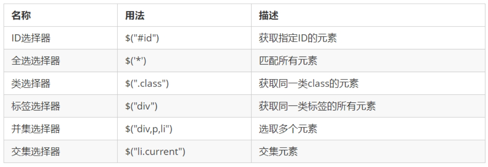
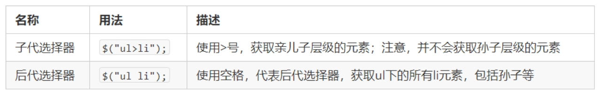

# JQuery

## JQuery入门

> JQuery 概述
> JQuery 的基本使用

### 1.JQuery 概述

#### 1.1 jQuery的概念

jQuery 是一个快速、简洁的 JavaScript 库，其设计的宗旨是“write Less，Do More”，即倡导写更少的代码，做更多的事情。
j 就是 JavaScript；Query 查询；意思就是查询js，把js中的DOM操作做了封装，我们可以快速的查询使用里面的功能。

jQuery 封装了 JavaScript 常用的功能代码，优化了 DOM 操作、事件处理、动画设计和 Ajax 交互。

学习jQuery本质: 就是学习调用这些函数（方法）。
jQuery 出现的目的是加快前端人员的开发速度，我们可以非常方便的调用和使用它，从而提高开发效率。

#### 1.2 jQuery 的优点

==优点==:

轻量级。核心文件才几十kb，不会影响页面加载速度
跨浏览器兼容。基本兼容了现在主流的浏览器
链式编程、隐式迭代
对事件、样式、动画支持，大大简化了DOM操作
支持插件扩展开发。有着丰富的第三方的插件，例如：树形菜单、日期控件、轮播图等
免费、开源

### 2.JQuery 的基本使用

#### 2.1 jQuery 的入口函数

```javascript
$(function () {   
    ...  // 此处是页面 DOM 加载完成的入口
 }) ; 
```

```javascript
$(document).ready(function(){
   ...  //  此处是页面DOM加载完成的入口
});
```

- 等着 DOM 结构渲染完毕即可执行内部代码，不必等到所有外部资源加载完成，jQuery 帮我们完成了封装。
- 相当于原生 js 中的 ==DOMContentLoaded==。
- 不同于原生 js 中的 ==load== 事件是等页面文档、外部的 js 文件、css文件、图片加载完毕才执行内部代码。
- 更推荐使用第一种方式。

#### 2.2 jQuery 的顶级对象 \$

1.\$ 是 jQuery 的别称，在代码中可以使用 jQuery 代替 \$，但一般为了方便，通常都直接使用 \$ 。
2.\$ 是 jQuery 的顶级对象，相当于原生 JavaScript 中的 window 。把元素利用 \$ 包装成 jQuery 对象，就可以调用 jQuery 的方法。

#### 2.3 jQuery 对象和 DOM 对象

**区别**

1. 用原生 JS 获取来的对象就是 DOM 对象
2. jQuery 方法获取的元素就是 jQuery 对象。
3. jQuery 对象本质是： 利用$对DOM 对象包装后产生的对象（伪数组形式存储）。

==注意：只有 jQuery 对象才能使用 jQuery 方法，DOM 对象则使用原生的 JavaScirpt 方法。==

**转换**

DOM 对象与 jQuery 对象之间是可以相互转换的。

因为原生 js 比 jQuery 更大，原生的一些属性和方法 jQuery没有给我们封装. 要想使用这些属性和方法需要把jQuery对象转换为DOM对象才能使用。

1. DOM 对象转换为 jQuery 对象： $(DOM对象)

```javascript
$('div')
```

2. jQuery 对象转换为 DOM 对象（两种方式）

```javascript
$('div') [index] index 是索引号
```

```javascript
$('div').get(index) index 是索引号
```

> 让谷歌浏览器播放有声音的视频，需要加muted
>
> ```html
> <video src="mov.mp4" muted></video>
> ```

## jQuery 常用API

> jQuery 选择器
> jQuery 样式操作
> jQuery 效果
> jQuery 属性操作
> jQuery 文本属性值
> jQuery 元素操作
> jQuery 尺寸、位置操作

### 1. jQuery 选择器

#### 1.1 jQuery 基础选择器

原生 JS 获取元素方式很多，很杂，而且兼容性情况不一致，因此 jQuery 给我们做了封装，使获取元素统一标准。

```javascript
$(“选择器”)   //  里面选择器直接写 CSS 选择器即可，但是要加引号
```



#### 1.2 jQuery 层级选择器

